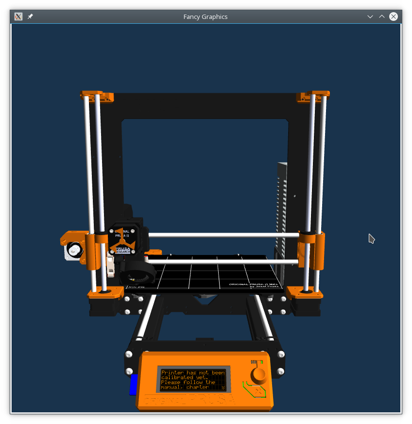
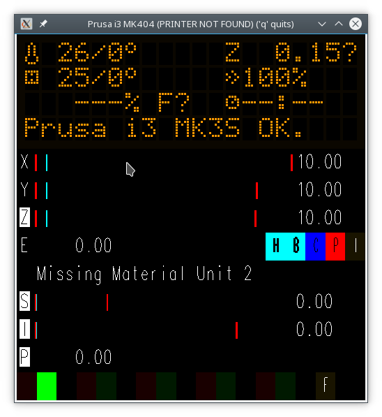

# MK404 - PRINTER NOT FOUND (formerly MK3SIM)
A project/repo for simulating Einsy (and eventually, other) Prusa (and eventually, other) hardware.

While this repo is private, it's something separate to share status updates, ideas, and related things for this topic. If I invited you to join, you're welcome to sit back and enjoy the ride, or contribute to hardware implementations and ideas as you desire.

*Summary status:* Mostly functional, should now be able to boot stock Prusa Marlin build for MK3S.
Remaining To-Dos of note:
- Telemetry system for VCD tracing, scripting
- a number of lofty goals...

*Current state of affairs and features*:
-  
- **The simulator can complete a self test!**

- Fancy graphics:

- Bootloader works
- LCD works. Brightness support has been fixed.
- Encoder and buttons are simulated
- Power panic (fake button) is wired up
- 2 UARTS are defined but not attached externally by default. Can be enabled by passing "-s" to access the primary serial port. UART2 is used for the MMU.
- Thermistors are defined for the bed, PINDA, ambient and hotend. Bed/PINDA read higher than expected over 40C due to code in the official firmware (prusa3d#2601)
- Fans have been attached, and can be controlled by the PWM output (or manually overridden to simulate conditions).
- Heater behaviour has been implemented. A Hotend heater is attached and appears functional. Same goes for the heatbed.
- PINDA simulation is present for both MBL and xyz cal. Toggle "sheet on bed" flag with the 'Y' key.
- Simulated SD card
- TMC2130s are sufficiently simulated for general operations.
- Motor/positioning tracking present.
- SPI flash for language support works, but because PTYs lack DTR it must be done either in two stages, or using the example script to trigger a reset at the right time.
- The timer bug has been resolved using a customized build of SimAVR.
- Flash/eeprom is persisted between reboots.
- Virtual MMU support:

- The MMU supports multicolour printing:

# Getting Started:

To get stared, clone the MK404 repo. the 3rdParty/simavr folder may be empty, you will need to `cd` into the checkout and run `git submodule init` and `git submodule update` from within it to pull down the correct simavr dependency. This should also initialize the `tinyobjloader` and `TCLAP` dependencies.

This is now a `cmake` project and independent of simAVR. You can follow normal cmake procedures, using your favourite IDE (or with cmake-gui). The submodules will be built automatically and taken care of for you.

You will need to use a fairly recent version of GCC/G++ (I use 7.4.0). Older versions from the 4.8 era may not support some of the syntax used.

Windows is not officially supported/maintained but current status (as of May 2020) is that you can build and execute the program using Cygwin with the appropriate dependencies. You will need to change some of the SimAVR code as described in http://fabricesalvaire.github.io/simavr/gitorious-get-started.html to get it to compile. MK404 depends on libelf, freeglut, GL, GLEW, bintools, SDL-audio, and pthread. Due to SimAVR's heavy dependency on POSIX features (some of which we also use) and the fact I run linux as my day-to-day OS, it is unlikely there will be a native Windows build in the forseeable future.

### Command line arguments:
- Current arguments can be viewed with the -h flag, should this README become outdated.

[Argument reference](ref/CommandLine.md)

### Scripting:
- The simulator supports basic command line scripting. At some point we will probably also support more advanced VCD input options.

[General scripting info](ref/Scripting.md)
[Script command reference for default printer](../ref/Scripting.md)

### Telemetry:
- The simulator's VCD trace system is categorized so you can enable groups or individual trace items from the command line with the `-t` argument.

[Look here for an example list of trace options](ref/TraceOptions.md)

### Mouse Functions:
#### LCD Window:
- Scroll wheel moves the encoder.
- Left or right button down/up controls click/release
#### Printer visualization Window (when not in nozzle-cam mode):
- Left button: Rotate
- Middle button: Pan
- Right button + move (or scroll wheel): Zoom/Z travel

### Key functions:
- `w` and `s` move the encoder.
- `enter` is the encoder button
- `q` quits.
- `p` simulates a power panic
- `c` inserts/removes the SD card
- `d` spews program counter output to console.
- `1` changes the LCD color scheme.
- `r` resets the printer (X button)
- `t` does a factory reset (reset & hold encoder)
- `h` just holds the encoder.
- `m` toggles audio muting (beeps)
- `y` adds/removes the steel sheet from the heatbed for PINDA MBL or XYZ cal
- `f` toggles filament presence
- `z` pauses Einsy execution without stopping GL interactivity (so you can still pan/scroll/zoom the fancy graphics)
- `l` clears the current print visual from the print bed.
- `n` toggles "Nozzle cam" mode
- `` ` `` (backtick) resets the camera view
