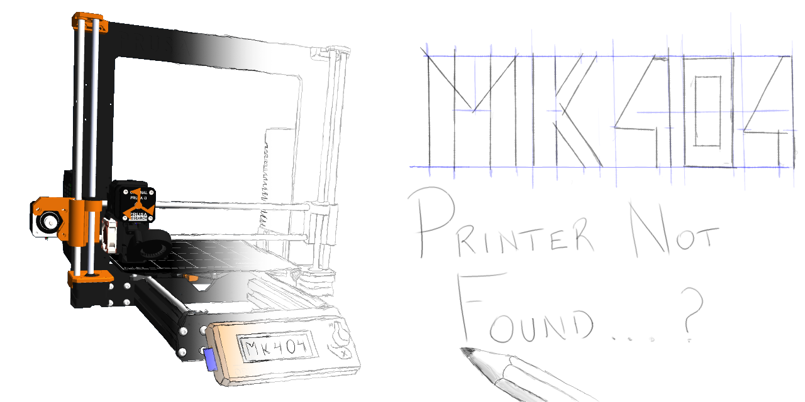

# MK404 - PRINTER NOT FOUND (formerly MK3SIM)
A project/repo for simulating Einsy (and eventually, other) Prusa (and eventually, other) hardware.

*Summary status:* "Mostly" functional, it runs stock firmware very close to the real thing, and should now be able to boot stock Prusa Marlin build for MK3S. "Mostly" because while the overall system is probably usable for the majority of use cases, some aspects of the hardware are simulated only to the extent necessary to get the system working. For example, the TMC "stallguard" register is minimally implemented, and the microstep count is not.

Remaining To-Dos of note:
- [See open issues...](https://github.com/vintagepc/MK404/issues/)

*Current state of affairs and features*:

Be sure to check out the [Historical timeline](https://github.com/vintagepc/MK404/wiki/Historical-Timeline) to get a peek at the growth of MK404.

-  
- **The simulator can complete a self test!**

- Fancy graphics:

- Bootloader works
- LCD works. Brightness support has been fixed.
- Encoder and buttons are simulated
- Power panic (fake button) is wired up
- 2 UARTS are defined but not attached externally by default. Can be enabled by passing "-s" to access the primary serial port. UART2 is used for the MMU.
- Thermistors are defined for the bed, PINDA, ambient and hotend. Bed/PINDA read higher than expected over 40C due to code in the official firmware (prusa3d#2601)
- Fans have been attached, and can be controlled by the PWM output (or manually overridden to simulate conditions).
- Heater behaviour has been implemented. A Hotend heater is attached and appears functional. Same goes for the heatbed.
- PINDA simulation is present for both MBL and xyz cal. Toggle "sheet on bed" flag with the 'Y' key.
- Simulated SD card
- TMC2130s are sufficiently simulated for general operations.
- Motor/positioning tracking present.
- SPI flash for language support works, but because PTYs lack DTR it must be done either in two stages, or using the example script to trigger a reset at the right time.
- The timer bug has been resolved using a customized build of SimAVR.
- Flash/eeprom is persisted between reboots.
- Virtual MMU support:

- The MMU supports multicolour printing:

# Getting Started (Building):

To get stared, clone the MK404 repo. the 3rdParty/simavr folder may be empty, you will need to `cd` into the checkout and run `git submodule init` and `git submodule update` from within it to pull down the correct simavr dependency. This should also initialize the `tinyobjloader` and `TCLAP` dependencies.

This is now a `cmake` project and independent of simAVR. You can follow normal cmake procedures, using your favourite IDE (or with cmake-gui). The submodules will be built automatically and taken care of for you.

You will need to use a fairly recent version of GCC/G++ (I use 7.4.0). Older versions from the 4.8 era may not support some of the syntax used. Newer versions (G++ 10) may complain about new warnings that are not present in 7.4. You can set a CMAKE option to disable -Werror in this case.

## Non-Linux platforms and prebuilt binaries:
OSX and Cygwin binaries are built but not actively supported. See [Platforms supported](https://github.com/vintagepc/MK404/wiki/Supported-Operating-Systems) for more information on building or running on these operating systems, as well as required packages.

#### Tips:
By default, the flash and EEPROM will be blank on first launch or if you delete the associated .bin files.
You will need to choose and load a firmware file (.afx, .hex) at least once with `-f` or by flashing it from the bootloader `-b` with serial (`-s`) enabled.

You can make an SD card image and copy files to it using `mcopy`, or by placing them in the SDCard folder and running the appropriate step in the makefile.

### Controls:

* [Mouse](https://github.com/vintagepc/MK404/wiki/Mouse-Functions)
* [Keyboard](https://github.com/vintagepc/MK404/wiki/Key-Functions)

### Reference documentation:
Advanced documentation has moved to the [Wiki](https://github.com/vintagepc/MK404/wiki):
* [Argument reference](https://github.com/vintagepc/MK404/wiki/CommandLine)
* [General scripting info (not in wiki)](scripts/Scripting.md)

* [Script command reference](https://github.com/vintagepc/MK404/wiki/Scripting)
* [Trace option reference](https://github.com/vintagepc/MK404/wiki/TraceOptions)
