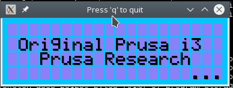
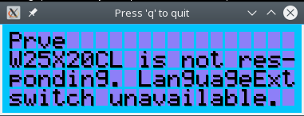

# MK3SIM
A project/repo for simulating Einsy hardware. 

Not much to see here yet, I figured that I'd just start something separate to share status updates and collaborate on this without cluttering the main repo.

Current state of affairs:
- Bootloader works:

- LCD works (partially)
- Encoder and buttons are simulated
- Power panic (fake button) is wired up
- Firmware starts to boot, detects missing SPI flash:

- Bootloop issue (#11) in SerialPrintPGM.
