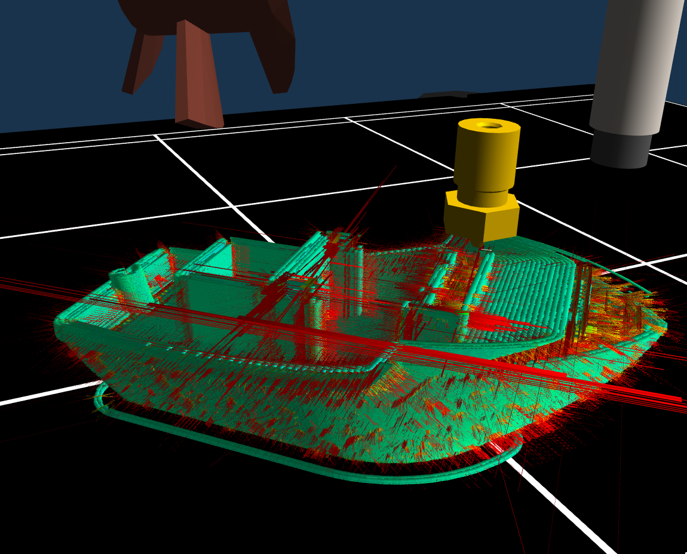
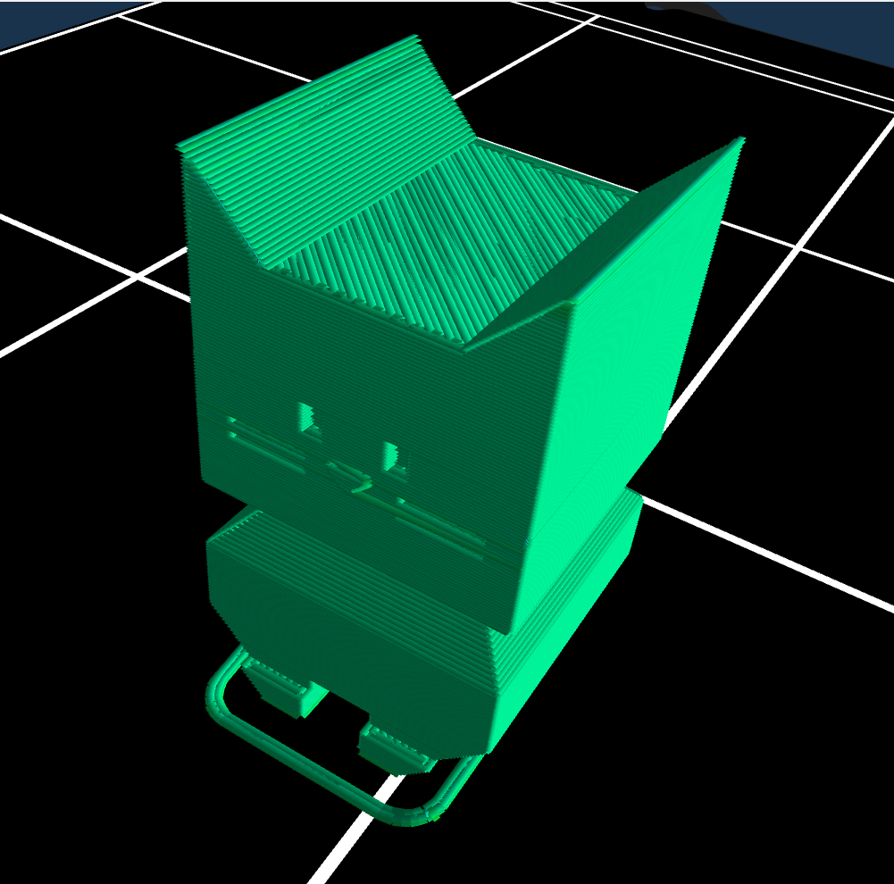
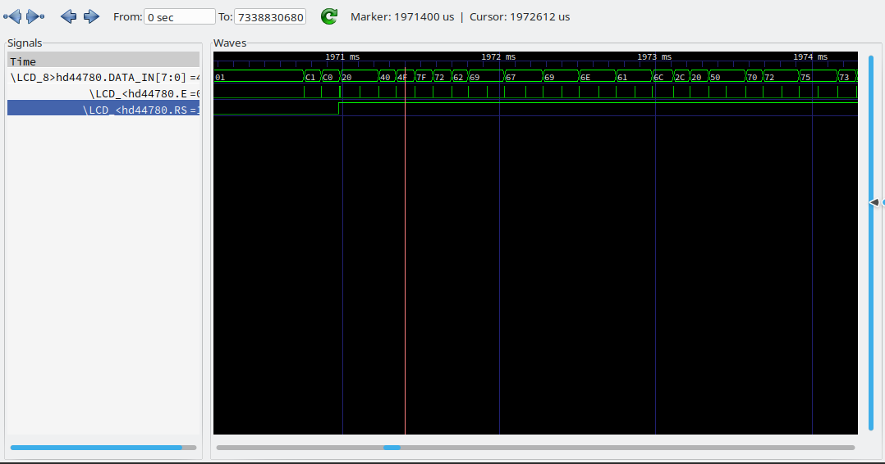
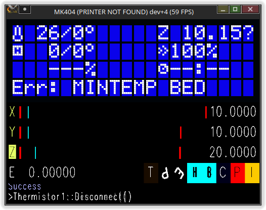
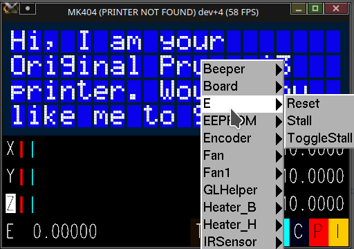

    

# Introduction 

MK404 is a 3D printer simulator. Specifically, it is a very technically oriented simulation, with several specific development-oriented goals in mind:

- Fast turnaround for testing changes - No more waiting 5 minutes for your printer to flash and reboot. 

- Hardware-accurate simulation - It should run the stock factory firmware and this firmware should not know the difference. 

- Safe testing - Test your firmware changes without having to worry about accidentally damaging your real printer if something goes wrong. 

- Easy gdb debugging - no special hardware required. The SimAVR core supports using avr-gdb to debug code on the target platform. 

- Advanced non-GDB debugging - things like stepper timing and extrusion behaviour that are tricky to see on real prints can be examined in a reproducible environment.

- Advanced interaction - Control aspects of the printer and modify its behaviours to simulate real hardware faults and scenarios. 

- Extensibility - The SimAVR core supports many AVR microprocessors; in theory any AVR-based printer can be supported by implementing support for its peripherals. 

- Experimentation - While not designed for this it can also be a fun tool you can play with to learn more about how your printer and its firmware works!

- Fancy(ish) 3D graphics. (Yes, we support skinning like the awesome Bear Mod if you want to beef up your virtual Prusa!).

### Why the name?

It's a bit of nerdy meta-humour, comprised of several components :)
- HTTP error 404 means a resource is missing, in this case, a physical printer. Perhaps someday we'll simulate an AVR based Teapot and have to account for [HTTP Status code 418](https://developer.mozilla.org/en-US/docs/Web/HTTP/Status/418)
- Prusa's [404 Error Page](https://www.prusaprinters.org/thisisanerror) that teases a future printer
- Prusa's naming of their line of i3 FFF/FDM printers using the MK1/MK2/MK3 designation
- A logical assumption that a successor to the MK3/S/+ line will probably be dubbed the MK4... At which point, there will still be 400 more iterations to go before we encounter a naming conflict, so we should be safe for a little while. 

## Printers Supported

As of this writing, the following printer models are supported. The [MK404 Wiki](https://github.com/vintagepc/MK404/wiki) is more likely to be up to date. 

I currently only support the Prusa ecosystem because that is what I have and what I am familiar with. 
You are welcome to submit a [New Printer Request](https://github.com/vintagepc/MK404/issues/new/choose) and while I will do my best there are some limitations here - space and money. Unfortunately developing hardware simulation is not trivial and is most easily done if one has the real hardware in question to inspect and manipulate. Data-sheets can only get you so far in terms of weird corner case behaviours. 

If you would like to contribute support for your particular printer yourself, feel free to get in touch!

Model|Status (Not started, In Progress, Awaiting Merge, or Finished)
-----|------
Prusa MK1 |  ✔️  Finished ❕ No 3D visuals.
Prusa MK2/MK2S | ✔️  Finished 
Prusa MK2/MK2S MMU |  ✔️  Finished
Prusa MK2.5 | ✔️  Finished
Prusa MK2.5 MMU2 |  ❌ Not Started
Prusa MK2.5S |  ✔️  Finished
Prusa MK2.5S MMU2 |  ❌ Not Started
Prusa MK3 | ✔️  Finished
Prusa MK3 MMU2 |  ✔️  Finished
Prusa MK3S |  ✔️  Finished
Prusa MK3S MMU2 | ✔️  Finished

## What can it do? (Feature Highlights)

- Please see [Features and Capabilities](https://github.com/vintagepc/MK404/wiki/Features-and-Capabilities-Summary) for an outline of the status of various hardware component simulation. Some things are not completely implemented, but for the most part the missing things are either abstractions we don't need to simulate at this time, or simply not required for our goals. 

Here are a few major highlights:

While we strive to maintain compatibility with stock firmware, this doesn't mean you cannot run other firmware. In fact, MK404:

### Runs Marlin:

### Runs Klipper

- [See Here](https://github.com/vintagepc/MK404/issues/263) Note that Klipper support is alpha and while it can be made to work, you **must** have a beefy computer due to the real-time execution requirements of running both the simulator and the Klipper back-end on the same PC. At least 8 cores or threads are recommended as otherwise the context swapping can stall Klipper long enough to cause an error. 

### Supports the MMU2 and MMU1

- You can do simulated multicolour prints, and the MMU emulation is done in the same fashion - in other words, it runs the stock factory firmware on a simulated AVR core, and is none the wiser of this. 

### Advanced Extrusion Visualization

In addition to simple line-extrusion visualization (the default), MK404 supports a volumetric extrusion visualization capability where extrusions can render as rectangles, or "pipes" with widths based on the extruded volume. There are two options for each of these modes depending on your graphics needs and capabilities:

- Averaged Quadrilaterals - a simple rectangle that consists of only 4 points that is as long as possible for the extrusion. 
- High-Res Quadrilaterals - Rectangles, but these are drawn on a per-extruder-step basis so that you can visualize the discretization of extrusion movements for debugging
- Averaged Pipes - Like Averaged Quad but the extrusions are drawn as diamond-shaped tubes so they have thickness to them. Requires significantly more vertices so make sure you have a good graphics card for any sizeable prints. 
- High-Res Pipes - The Pipe counterpart of High-Res Quads. Requires many, many, **many** more vertices. You may want to minimize the visualization window until the simulated print is finished since the drawing routines need to share memory with the calculations; as the print gets more complex these take longer and longer and your frame-rate (and therefore simulation time) will suffer.

#### Example of Quad_HR mode

The red spikes you can see are visualizations of the Linear Advance algorithm at work when the print changes direction or starts/stops extrusion. Unlike a real printer there is no fluid physics so an extruded step can "instantly" expand without any back-pressure. 

#### Example of Avg_Pipe mode

Note the linear advance steps are no longer visible and the extrusions are as long as possible along the travel path. 

### Debugging

- You can use AVR-GDB or any other tool that supports GDB-style debugging to step through your code in the simulated hardware environment. Here I'm using `avr-insight` to inspect a delay function.

### Signal Tracing

- MK404 makes use of SimAVR's VCD capabilities to dump certain signals to a value-change-dump file. You can use this to sniff bus traffic, check GPIO states, and many more items. See the [Trace Options](https://github.com/vintagepc/MK404/wiki/Trace-Options-Prusa_MK3S) pages for a more complete list of supported streams organized by printer model. 

### Scripting

- MK404 has an integrated scripting engine so you can drive the simulated hardware in a repeatable, non-interactive fashion. There are many capabilities, from toggling sensor states to waiting for a particular condition or signal-trace event. See the [Scripting Wiki](https://github.com/vintagepc/MK404/wiki/Scripting) for details on what items you can interact with, organized by printer. Scripting items can be used in a few ways:
  - From the command line,a text file passed in as an argument with `--script`.
  - Interactively, using the `--terminal` argument to provide a basic terminal you can use to type script commands.
  
    
  
  - Via context menu. Middle-clicking the window will bring up a menu containing any scripting controls that do not require input arguments.
    
    

### Simulated SD card support and Serial I/O

- MK404 comes with an internal utility to help you make blank FAT32 SD card images of varying sizes. There is also a convenient build step that will copy the contents of the `SDCard` folder into the image if you have `mtools` installed on your system. 
- You can also connect the simulated serial port to a pseudo-terminal (pty) and use any standard serial utility to send it GCode or commands.

### Much, much more!

I can't really begin to describe every detail on this page. If you can't find what you're looking for, be sure to check out the following resources:

- [Wiki](https://github.com/vintagepc/MK404/wiki)
- [SimAVR](https://github.com/buserror/simavr)
- [Discussions](https://github.com/vintagepc/MK404/discussions)
- [Issues](https://github.com/vintagepc/MK404/issues)

## History

For those of you wondering, this project started in early 2020 as a joke in one of the Prusa3D GitHub threads where I mused about the possibility of something like this to debug a particularly annoying Linear Advance issue. Searching turned up a little bit of work surrounding printer simulation, including @buserror (Author of the wonderful SimAVR) whom had started a SimRepRap project. Unfortunately nothing was in active development at the time, and nothing really usable for the desired purposes. 

I started playing with SimAVR as it was the most fully featured offering at the time and things just kind of went downhill from there... to the point where you're looking at a not insignificant amount of work over the better part of a year to get it to where it is today. I do have to credit a few people along the way, especially @wavexx, @leptun, @3d-gussner and @DRracer for their testing, feedback, and contributions to help make the project become a reality. 

Be sure to check out the [Historical timeline](https://github.com/vintagepc/MK404/wiki/Historical-Timeline) where I have collected some screenshots of notable development milestones in MK404's history.

## Timelapse

This is a time-lapse video I took of a 5-colour MMU virtual print. Note this is an older build so it is still using the older style line visualization for the print. Total simulation time was about 12 hours:



# Getting started

See [Supported Operating Systems](https://github.com/vintagepc/MK404/wiki/Supported-Operating-Systems) for more information specific to your platform. 
Using the download the buttons at the top of the page will take you to our "Releases" page where you will be able to download source code, or binary packages for various platforms. The `dev` tag will always be a build from the latest check-in, whereas the versioned releases will represent a notable collection of fixes or a milestone in the project's history. 

Be sure to check out the [main README](https://github.com/vintagepc/MK404) in the repo if you're interested in building from source. 

## Quick Reference

Just a few items you might wish to look at or learn more about, in a convenient HTML hyperlink format:

### Controls:

* [Mouse](https://github.com/vintagepc/MK404/wiki/Mouse-Functions)
* [Keyboard](https://github.com/vintagepc/MK404/wiki/Key-Controls)

### Reference documentation:
Advanced documentation and details are located in the project [Wiki](https://github.com/vintagepc/MK404/wiki). 

Some quick links for convenience:
* [Argument reference](https://github.com/vintagepc/MK404/wiki/Command-Line) - All the command line arguments available for operating your virtual printer.
* [General scripting info (not in wiki)](https://github.com/vintagepc/MK404/blob/master/scripts/Scripting.md) - Scripting overview, which let you make the printer behave differently or simulate failures while it's running.
* [Script command reference](https://github.com/vintagepc/MK404/wiki/Scripting) - Advanced scripting, with lists of all the script syntax.
* [Trace option reference](https://github.com/vintagepc/MK404/wiki/Trace-Options) - The trace system, for debugging particular data streams within the printer. 

### Open Source

- This project is open source under the [GPLv3](https://github.com/vintagepc/MK404/blob/master/COPYING) and we are proud to submit improvements and bugfixes we make to third party libraries upstream where practical, and we encourage you to submit your own improvements to MK404 for inclusion as part of the open-source culture. If you're interested in contributing, please see [Contribution Guidelines](https://github.com/vintagepc/MK404/blob/master/.github/CONTRIBUTING.md) for our contribution guidelines, and open a new issue or discussion to introduce yourself and how you'd like to help! 
